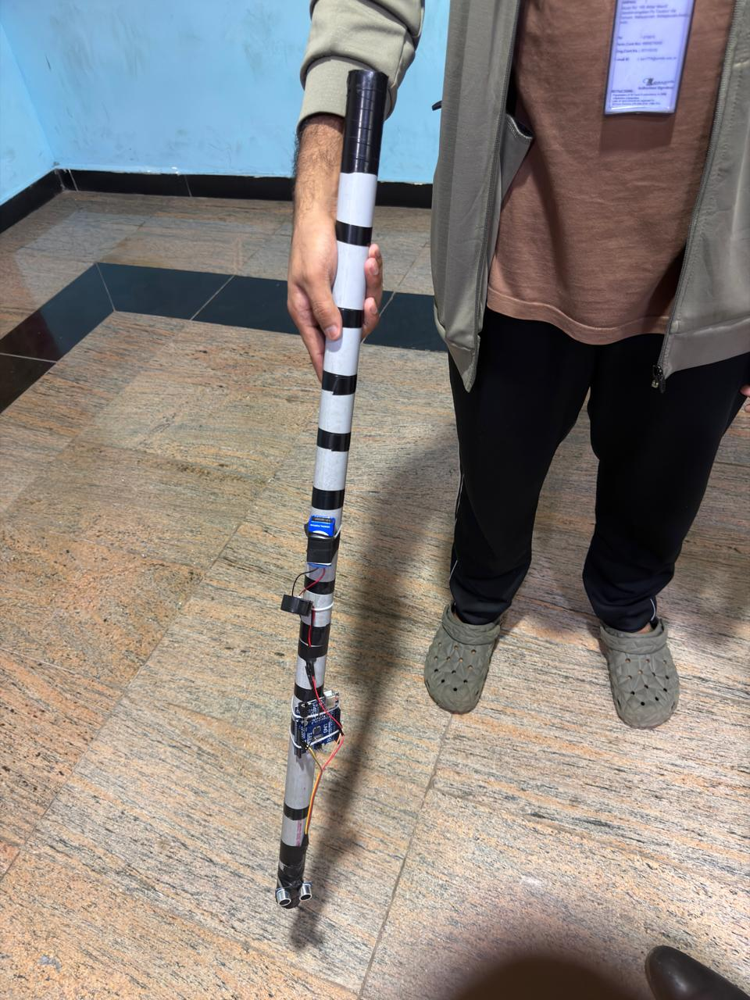

# Smart Blind Stick

A prototype assistive device designed to help visually impaired individuals detect nearby obstacles using an ultrasonic sensor and buzzer alert system.

## Features 
- Arduino-based obstacle detection
- Ultrasonic distance sensing
- Buzzer for real-time alerts
- Lightweight PVC body design

## Working 
The ultrasonic sensor continuously measures distance.
If an obstacle is detected within 15 cm, the buzzer activates to alert the user.

## Future Improvements
- Add vibration motor alerts for silent mode.
- Add Bluetooth + mobile app feedback.
- Add GPS navigation support.
- Add rechargeable battery with USB charging.
  
## Project Images

## Author
Ayaan Anwar Thazhathethil
